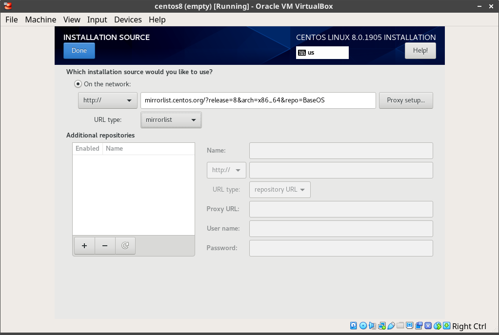
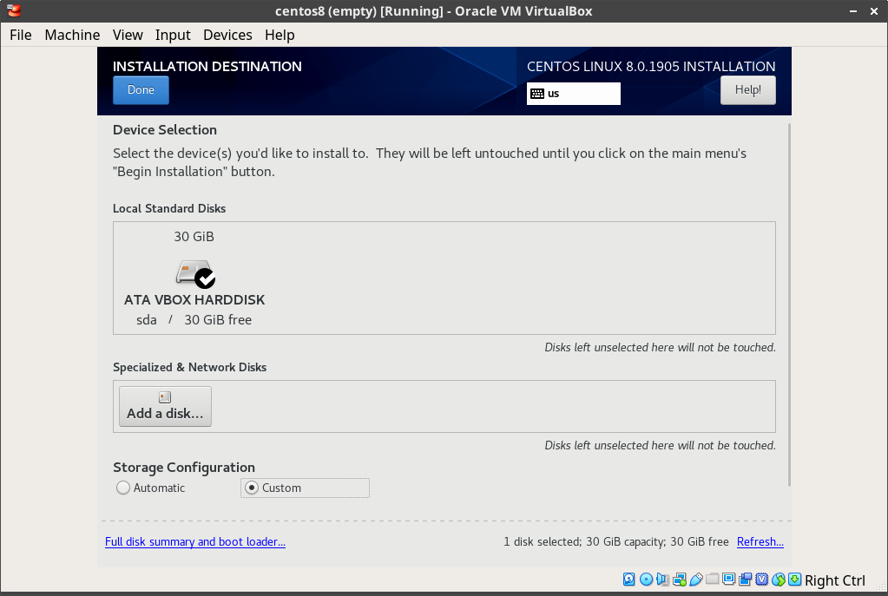
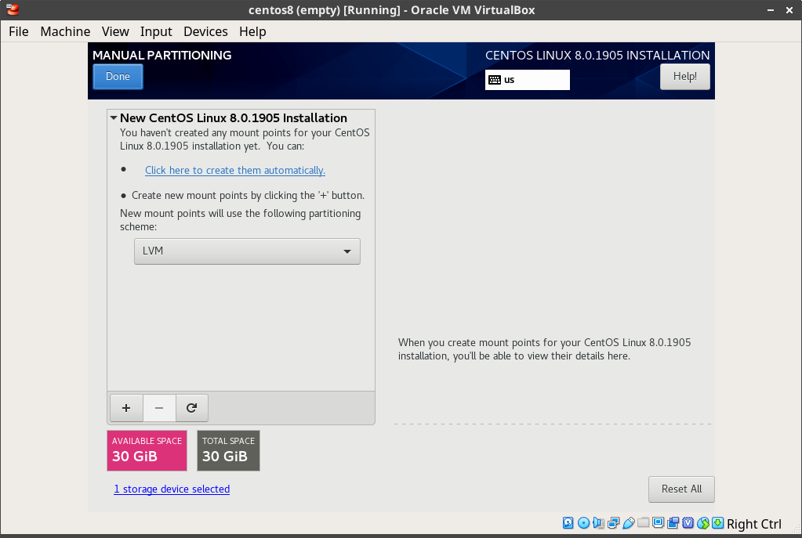
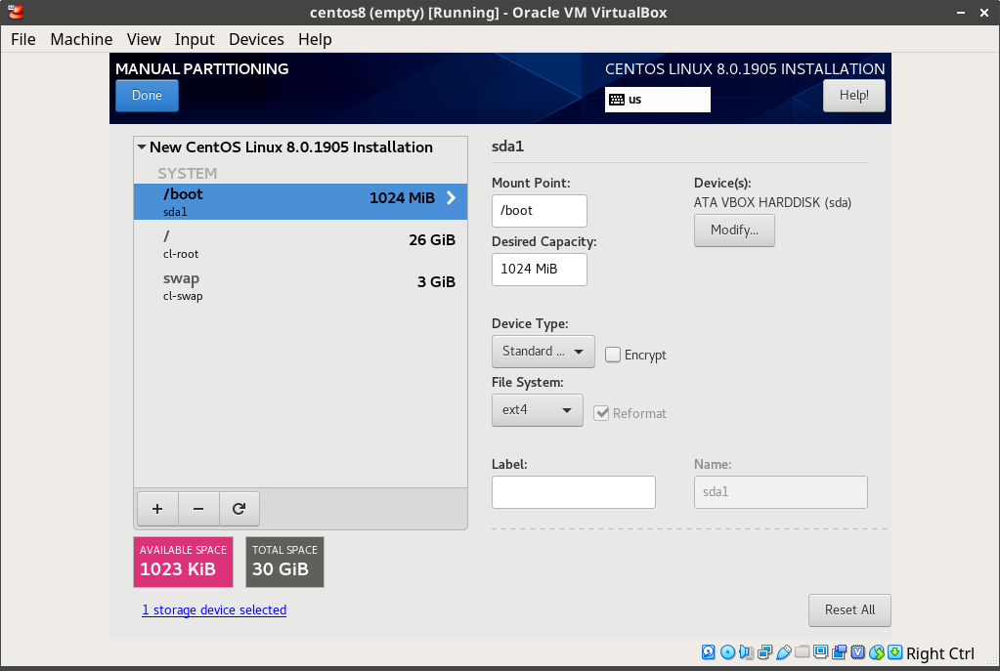

# viper-clone

This repository is a guide on creating a virtual environment that should nearly match that of viper.datasci.danforthcenter.org. The primarly differences between this and the actual server is that this requires additional configuration for users, groups, and data location.

---

## Table of Contents

* [Operating System](#operating-system)
* [Initial Configuration](#initial-configuration)
  * [Create users and groups](#create-users-and-groups)
  * [Install desktop environment](#install-desktop-environment)
  * [Install Guest Additions](#install-guest-additions)
  * [Install system dependencies](#install-system-dependencies)
* [Software Installation Guides](#software-installation-guides)
---

### Operating System

1. Download CentOS 8

    http://mirror.mobap.edu/centos/8.0.1905/isos/x86_64/CentOS-8-x86_64-1905-boot.iso

2. Set installation source

    Currently, there's a known bug ([#16456](https://bugs.centos.org/view.php?id=16456)) during a minimal installation of CentOS 8. It requires that
    you set the Installation Source manually. 

    Currently, the fix is to add the following as a mirrorlist

    ```
    http://mirrorlist.centos.org/?release=8&arch=x86_64&repo=BaseOS
    ```

    

3. Turn on network

4. Set Installation Destination (configures disk partitions)

    * Select **Custom** for Storage Configuration, Click **Done**
    
    
    
    * Click **Click here to create them automatically** to generate the recommended partitions.
    
    
    
    * Check generated partitions

      This should create a `/boot` (ext4), `/` (xfs, LVM), and `/swap` (swap, LVM) partitions.

    

    * Click **Done**, and then **Accept Changes**

5. Set Software Selection

    * Check Base Environment to **Server**
    * Check Add-Ons:
      * GNOME
      * Network File System Client
      * Headless Management
      * Scientific Support
      * System Tools
      * Graphical Administration Tools

6. Click **Begin Installation**

    * Set `root` password

7. Reboot


### Initial Configuration

#### Create users and groups

```bash
# Create supplementary users if needed
groupadd rootarch
usermod -aG rootarch root
adduser rsa-data
usermod -aG rootarch rsa-data
```

#### Install Desktop Environment

Log in as `root` and install package group, **Server with GUI**

```bash
dnf groupinstall -y "Server with GUI"
systemctl set-default graphical.target
systemctl isolate graphical.target
```

#### Install Guest Additions

Reference: https://www.if-not-true-then-false.com/2010/install-virtualbox-guest-additions-on-fedora-centos-red-hat-rhel/

```bash
dnf update kernel*

# If kernel was updated, reboot

# Mount VirtualBoxGuestAdditions
# Device Menu > "Insert Guest Additions CD Image"... (download if necessary)
mkdir -pv /media/VirtualBoxGuestAdditions
mount -r /dev/cdrom /media/VirtualBoxGuestAdditions

# Install Guest Additions dependencies
dnf install -y https://dl.fedoraproject.org/pub/epel/epel-release-latest-8.noarch.rpm
yum install -y gcc kernel-devel kernel-headers dkms make bzip2 perl

# Add kernel environment variable
KERN_DIR=/usr/src/kernels/`uname -r`
export KERN_DIR

# Install Guest Additions
cd /media/VirtualBoxGuestAdditions
./VBoxLinuxAdditions.run
reboot
```

#### Install system dependencies

1. Update system and install dependencies
    ```bash
    dnf update -y
    dnf install -y epel-release git wget gcc-c++ cmake python2 python36
    curl https://bootstrap.pypa.io/get-pip.py -o get-pip.py
    python get-pip.py
    rsync -avuP --stats tparker@stargate.datasci.danforthcenter.org:/shares/ctopp_share/data/repos/jdk/jdk-8u202-linux-x64.rpm .
    rpm -ivh jdk-8u202-linux-x64.rpm
    alternatives --set java /usr/java/jdk1.8.0_202-amd64/jre/bin/java
    git clone https://github.com/Topp-Roots-Lab/operations-scripts.git --branch master --single-branch
    ```

2. Install TigerVNC
    ```bash
    dnf install -y tigervnc-server tigervnc-server-module
    ```

3. Adding VNC endpoints. Create service files for user VNC servers (https://www.linuxtechi.com/install-configure-vnc-server-centos8-rhel8/)
    
    Each service file follows this template:

    ```
    # /etc/systemd/system/vncserver@:<portnumber>.service
    [Unit]
    Description=Remote Desktop VNC Service
    After=syslog.target network.target

    [Service]
    Type=forking
    WorkingDirectory=/home/username
    User=username
    Group=groupname

    ExecStartPre=/bin/sh -c '/usr/bin/vncserver -kill %i > /dev/null 2>&1 || :'
    ExecStart=/usr/bin/vncserver -autokill %i
    ExecStop=/usr/bin/vncserver -kill %i

    [Install]
    WantedBy=multi-user.target
    ```

    Make sure to replace the `username`, `group`, and `WorkingDirectory` for the user's info. The `portnumber` in the file's name sets the port offset value for the user. Currently, we are keeping track of who has been assigned which port in a [Google Sheet](https://docs.google.com/spreadsheets/d/1PfnRdNhHx81Jcx219MZ2Xoki_c-hDUeL47ug8NEcJbs/edit?usp=drive_web&ouid=107635210664309276124).

    For ease, I've included a copy of the current user's service files in this repo.

    ```bash
    cp -Rv operations-scripts/servers/viper/vnc/* /etc/systemd/system/
    ```

    **NOTE about VNC passwords**: Once a user has access a VNC endpoint at least once, their password is stored in `$HOME/.vnc/passwd` by default. Therefore, for anyone that has started their VNC server in the past, you should not need to set a password. Otherwise, use the following command to set the password for the user.
  
    ```bash
    sudo -u username vncpasswd
    ```

    **Make sure to open ports for VNC endpoints**
    
    Allow port in firewall

    **Make sure to replace the port number with the correct value when allowing it through the firewall.** VNC uses ports starting at 5900, so add the assigned port to 5900 to get the actual port. E.g., If you assign porn `126` to someone, open the port `6026`.

    ```bash
    systemctl daemon-reload
    systemctl start vncserver@:portnumber.service
    systemctl enable vncserver@:portnumber.service
    firewall-cmd --permanent --add-port=5900+portnumber/tcp
    firewall-cmd --reload
    ```

    Example for `root`
    ```bash
    systemctl daemon-reload
    systemctl start vncserver@0.service
    systemctl enable vncserver@0.service
    firewall-cmd --permanent --add-port=5900/tcp
    firewall-cmd --reload
    ```

### Software Installation Guides

#### RSA-GiA

```bash
# Download RSA-GiA source
git clone https://github.com/tparkerd/rsa-gia.git --branch master --single-branch

# Install dependencies for RSA-GiA
dnf install -y ImageMagick

# Gia2d Dependency: png12, tiff
# https://centos.pkgs.org/8/centos-appstream-x86_64/libpng12-1.2.57-5.el8.x86_64.rpm.html
dnf install -y libpng12

# Libpng15
git clone https://github.com/glennrp/libpng.git --branch libpng15 --single-branch && cd libpng
./configure --exec-prefix=/usr --libdir=/lib64
make && make check && make install && cd ..

# libtiff3
# Compile libtiff3 (http://www.libtiff.org/)
wget http://download.osgeo.org/libtiff/tiff-3.9.7.tar.gz
tar -zvxf tiff-3.9.7.tar.gz && cd tiff-3.9.7/
./configure --exec-prefix=/usr --libdir=/lib64
make && make check && make install && cd ..

# Qt4
# https://github.com/qt/qt.git

# Q4 Dependencies
# https://doc.qt.io/archives/qt-4.8/requirements-x11.html
# NOTE(tparker): There is not an entry for libglib-2.0 or libpthread
# As far as I can tell the glibc-devel provides the necessary libraries for libglib-2.0
# And libpthread appears to already be installed by default for CentOS 8
# I added (libXtst-devel) because of https://www.programering.com/a/MjM3kjNwATA.html
dnf install -y libXrender-devel libXrandr-devel libXfixes-devel libXinerama-devel fontconfig-devel freetype-devel libXi-devel libXt-devel libXext-devel libX11-devel libSM-devel libICE-devel glibc-devel libXtst-devel

# https://download.qt.io/archive/qt/4.8/4.8.7/qt-everywhere-opensource-src-4.8.7.tar.gz.mirrorlist
# https://www.programering.com/a/MjM3kjNwATA.html
wget http://download.qt.io/archive/qt/4.8/4.8.7/qt-everywhere-opensource-src-4.8.7.tar.gz
tar -zxvf qt-everywhere-opensource-src-4.8.7.tar.gz && cd qt-everywhere-opensource-src-4.8.7/
echo 'yes' | ./configure  -opensource -shared -no-pch -no-javascript-jit -no-script
sed -i 's|view()->selectionModel()->select(index, QItemSelectionModel::Columns \& QItemSelectionModel::Deselect);|view()->selectionModel()->select(index, static_cast<QItemSelectionModel::SelectionFlags>(QItemSelectionModel::Columns \& QItemSelectionModel::Deselect));|g' ./src/plugins/accessible/widgets/itemviews.cpp
gmake -j4
gmake install
ln -s /usr/local/Trolltech/Qt-4.8.7/lib/libQtCore.so.4 /usr/lib64/libQtCore.so.4
cd ..

# Create installation folder
mkdir -pv /opt/rsa-gia/bin /etc/opt/rsa-gia /var/log/rsa-gia

# Copies of binaries from CentOS 6 instance of Viper
cp -Rv rsa-gia/dist/centos6-binaries/* /opt/rsa-gia/bin

# Add java to system path in /etc/profile.d
echo 'export PATH="$PATH:/opt/java/java_default/bin:/opt/local/bin"' > /etc/profile.d/rsagia.sh
# echo 'export JAVA_HOME=/opt/java/java_default' >> /etc/profile.d/rsagia.sh
echo 'export JAVA_HOME=/usr/java/jdk1.8.0_45' >> /etc/profile.d/rsagia.sh

source /etc/profile.d/rsagia.sh

# Install file manager tools
git clone https://github.com/Topp-Roots-Lab/rsa-tools.git
pip2 install -r rsa-tools/requirements.txt
mkdir -pv /opt/rsa-gia/bin/importer /opt/rsa-gia/bin/file-handlers /opt/rsa-gia/bin/gia-programs/quality-control/qc
cp -Rv rsa-tools/Importer/* /opt/rsa-gia/bin/importer/
cp -Rv rsa-tools/FileHandlers/* /opt/rsa-gia/bin/file-handlers/
cp -Rv rsa-tools/QualityControl/* /opt/rsa-gia/bin/gia-programs/quality-control/qc/

# Compile permission elevation scripts and set setuid
g++ /opt/rsa-gia/bin/importer/rsa-mv2orig-launcher.cpp -o /opt/rsa-gia/bin/importer/rsa-mv2orig-launcher
chown -v rsa-data:rootarch /opt/rsa-gia/bin/importer/rsa-mv2orig-launcher
chmod -v 4750 /opt/rsa-gia/bin/importer/rsa-mv2orig-launcher
chmod -v +x /opt/rsa-gia/bin/importer/rsa-mv2orig.py

g++ /opt/rsa-gia/bin/file-handlers/rsa-renameorig-launcher.cpp -o /opt/rsa-gia/bin/file-handlers/rsa-renameorig-launcher
chown -v rsa-data:rootarch /opt/rsa-gia/bin/file-handlers/rsa-renameorig-launcher
chmod -v 4750 /opt/rsa-gia/bin/file-handlers/rsa-renameorig-launcher
chmod -v +x /opt/rsa-gia/bin/file-handlers/rsa-renameorig.py

chown -v rsa-data:rootarch /opt/rsa-gia/bin/gia-programs/quality-control/qc/all_qc_folder.py
chmod -v +x /opt/rsa-gia/bin/gia-programs/quality-control/qc/all_qc_folder.py

# Setup data folders and set ownership & permissions
rsa-create-orig
echo 'yes' | rsa-setrights-orig
echo 'yes' | rsa-setrights-proc
chown -Rc rsa-data:rootarch /data
chmod -Rv a-x+X,u-x+rwX,g-swx+rwX,o-wx+rX /data

# Install templates into data folder
src_tmplt='/opt/rsa-gia/bin/rsa-gia-templates/*'
dest_tmplt='/data/rsa/rsa-gia-templates'
chown -v rsa-data:rootarch "$dest_tmplt"
chmod -v 2750 "$dest_tmplt"
cp -Rv $src_tmplt $dest_tmplt
# directories
find $dest_tmplt -mindepth 1 -type d -exec chown -v rsa-data:rootarch '{}' \;
find $dest_tmplt -mindepth 1 -type d -exec chmod -v 2750 '{}' \;
# files
find $dest_tmplt -mindepth 1 -type f -exec chown -v rsa-data:rootarch '{}' \;
find $dest_tmplt -mindepth 1 -type f -exec chmod -v 640 '{}' \;
rm -rvf /opt/rsa-gia/bin/rsa-gia-templates /opt/rsa-gia/bin/rsa-install-rsagiatemplates rsa-create-rsadata-rootarchrsa-mv2orig

# Create rsa-gia application shortcut
cp -Rv /vagrant/shared/rsa-gia/rsagia.desktop /usr/share/applications/

# Move configuration files
mv -v /opt/rsa-gia/bin/gia-java/default.properties /etc/opt/rsa-gia

# Manually create data foldres in /data/rsa/to_sort and assign appropriate
# permissions
# Placeholder script for testing
mkdir -pv /data/rsa/to_sort/root
chown -Rv rsa-data:rootarch /data/rsa/to_sort/
chmod -Rv a-x,u-x+rwX,g-wx+rX,o-rw+X /data/rsa/to_sort/

# NOTE(tparker): Until the reference is changed in the source code (QualityControl.java), this needs to be created as a workaround
mkdir -pv /usr/local/bin/gia-programs/quality-control/qc/
ln -sv /usr/local/bin/gia-programs/quality-control/qc/all_qc_folder.py

# Copy application icons to pixmaps folder
cp -Rv rsa-gia/dist/rsa-gia.png /usr/share/pixmaps/
```

#### Meshlab

**Must be using a desktop environment--i.e., TigerVNC**

```bash
# Download and install dependencies
wget http://download.qt.io/archive/qt/5.9/5.9.8/qt-opensource-linux-x64-5.9.8.run
chmod +x qt-opensource-linux-x64-5.9.8.run
# Make sure to enable/select Qt 5.9.8 in component selection
./qt-opensource-linux-x64-5.9.8.run

git clone https://github.com/cnr-isti-vclab/meshlab.git --branch master --single-branch
git clone https://github.com/cnr-isti-vclab/vcglib.git --branch devel --single-branch

# Build Meshlab from source
QMAKE_FLAGS=('-spec' 'linux-g++' 'CONFIG+=release' 'CONFIG+=qml_release' 'CONFIG+=c++11' 'QMAKE_CXXFLAGS+=-fPIC' 'QMAKE_CXXFLAGS+=-std=c++11' 'QMAKE_CXXFLAGS+=-fpermissive' 'INCLUDEPATH+=/usr/include/eigen3' "LIBS+=-L`pwd`/lib/linux-g++")
MAKE_FLAGS=('-j4')
dnf install -y qt5-qtbase qt5-qtbase-devel qt5-qtscript qt5-qtscript-devel qt5-qtxmlpatterns qt5-qtxmlpatterns-devel mesa-libGLU mesa-libGLU-devel
ln -s /opt/Qt5.9.8/5.9.8/gcc_64/bin/qmake /usr/local/bin/qmake

pushd meshlab/src/external
qmake external.pro ${QMAKE_FLAGS[@]} && make ${MAKE_FLAGS[@]}
cp -v lib/linux/* lib/linux-g++/ 

cd ../common
qmake common.pro ${QMAKE_FLAGS[@]} && make ${MAKE_FLAGS[@]}

cd ..
qmake meshlab_full.pro ${QMAKE_FLAGS[@]} && make ${MAKE_FLAGS[@]}
mkdir -p /opt/meshlab
cp -Rv distrib/* /opt/meshlab
popd

# Add to PATH
echo 'export PATH="$PATH:/opt/meshlab"' >> /etc/profile.d/meshlab.sh
echo 'export LD_LIBRARY_PATH="/opt/meshlab"' >> /etc/profile.d/meshlab.sh
source /etc/profile.d/meshlab.sh

# Copy desktop entry and icon
cp -Rv operations-scripts/meshlab/meshlab.desktop /usr/share/applications/
cp -Rv operations-scripts/meshlab/meshlab.png /usr/share/pixmaps/
```

#### Tassel 5

https://www.maizegenetics.net/tassel

This set up requires root access and a GUI interface. Personally, I used the default values and installed the program into `/opt` and creating symlinks in `/usr/local/bin`.

```bash
wget https://tassel.bitbucket.io/installer/TASSEL_5_unix.sh
chmod +x TASSEL_5_unix.sh
./TASSEL_5_unix.sh
```

#### Minimap2

https://github.com/lh3/minimap2

```bash
curl -L https://github.com/lh3/minimap2/releases/download/v2.17/minimap2-2.17_x64-linux.tar.bz2 | tar -jxvf -
mv -v minimap2-2.17_x64-linux/* /opt/minimap2
echo 'export PATH="$PATH:/opt/minimap2"' >> /etc/profile.d/minimap2.sh
echo 'export LD_LIBRARY_PATH="/opt/minimap2"' >> /etc/profile.d/minimap2.sh
source /etc/profile.d/minimap2.sh
```

#### Guppy 

https://github.com/nanoporetech

Guppy is a priorioty software and requires a log in to download its installation file. As a workaround, a copy of the installation file(s) is stored in the lab's share on the Center cluster.

```bash
tar -zxvf /shares/ctopp_share/data/repos/guppy/ont-guppy-cpu_3.2.1_linux64.tar.gz -C /opt
echo 'export PATH="$PATH:/opt/guppy"' >> /etc/profile.d/guppy.sh
echo 'export LD_LIBRARY_PATH="/opt/guppy"' >> /etc/profile.d/guppy.sh
source /etc/profile.d/guppy.sh
```

#### Flye

https://github.com/fenderglass/Flye

```bash
git clone https://github.com/fenderglass/Flye
cd Flye
python setup.py install
```

#### Miniconda

_TBD_

#### Miniconda
```bash
# Install miniconda
wget https://repo.anaconda.com/miniconda/Miniconda3-latest-Linux-x86_64.sh | bash
# https://docs.conda.io/projects/conda/en/latest/user-guide/configuration/admin-multi-user-install.html

# Configure miniconda to include bioconda channel
# Set up bioconda
conda config --add channels bioconda
```

#### NodeJS
```bash
curl -sL https://rpm.nodesource.com/setup_10.x | sudo bash -
yum install nodejs
npm install -g n
n latest
```

## Troubleshooting

Please create an issue to report any issues or errors you encounter while following this guide.

# FAQ

## Why Java 1.8u202?

  JavaFX library was removed in later versions, and it is a required dependency. It appears that JavaFX is **not** free for newer versions.

## Why install RSA-GiA into `/opt`?

  Originally, the application was installed into `/opt/local/bin`. I believe that the [Filesystem Hierarchy Standard](https://en.wikipedia.org/wiki/Filesystem_Hierarchy_Standard) has changed since RSA-GiA original development. It seems like `/opt/local/bin` does not follow the current FHS, so I am choosing to place the files into `/opt/rsa-gia`. As such, must be added to `PATH`, and is done using `/etc/profile.d`

  That being said, you could consider adding symlinks into the `/usr/local/bin` folder instead of adding `/opt/rsa-gia` to `PATH`.


### Additional Notes
Below is a list of files that have **not** changed from rsa-pipeline-2 installation and those found in `/opt/local/bin/` on the CentOS 6.6 instance of `viper.datasci.danforthcenter.org`

    checksum                          filepath
    ---                               ---
    f1f1c86ab03226b10cc2ef48bc1e27a8  ./gia/rio2.zip
    8bf7ce3c305533055691684edeb92b41  ./gia/readme.txt
    46b0f7ff00f52d906b519780f9e521df  ./gia/authors.txt
    0c960c799dc2198e0d7f180dd0b1ba68  ./gia/list_licenses.txt
    fa7568429c94a676bc6417bdf47a4271  ./gia/settings.xml
    d52c996c9fc43fd326c73637cd51e059  ./gia/copyright.txt
    9ce5a0a21fe6256073a9e2a1ed0d0db2  ./gia/gia.log
    84271c6175f6cfbd40e584482e0052bc  ./gia/interpreter
    c3ba9125d03dca852be495de03433de0  ./gia/giaroots
    261a52eac7cf229a435bcdfeeabc4508  ./rsa-fix-GLIBCXX_3.4.11-not_found-problem
    01755093c5305029fd29371d70f8d578  ./rsa-chkrights-proc
    8b6831c02a6faad854a3310e4acc27ed  ./rsa-chkrights-orig
    f2409716c87609bf9df61057ef9ea9f7  ./skeleton3D/Skeleton
    899b4676f7c440996cdd2693682f69f1  ./skeleton3D/rsa-pipeline-license.txt
    f5da9e913756e1679a97a64558fe432f  ./rsa-create-rsadata-rootarch
    4613660687de1a78a781fd214175adfc  ./rsa-pipeline-contributors.txt
    f6b69096d34b1072b6e5fca97d770c95  ./rsa-setrights-orig
    6de709f749b810b0c9f991f9f6a33a96  ./rsa-reconstruction3D
    9843428df23f3383f13cf686cff98fc1  ./reconstruction3D-stl/recon-v4-stl
    899b4676f7c440996cdd2693682f69f1  ./reconstruction3D-stl/rsa-pipeline-license.txt
    71fdca3474ed993e626276d2c64a63ad  ./rsa-install-rsagiatemplates
    899b4676f7c440996cdd2693682f69f1  ./rsa-pipeline-license.txt
    85e2a7eda4dbf8709b86b8bf5b394763  ./rsa-skeleton3D
    071f8524051589c9ab04eb07d87cc891  ./rsa-isosurface
    7833abad312dd6afe8b44e41ebfc33bd  ./rsa-setrights-proc
    899b4676f7c440996cdd2693682f69f1  ./reconstruction3D/rsa-pipeline-license.txt
    2c4ed390ddfd56a009b6539557b9dd2a  ./reconstruction3D/Reconstruction
    c469e97018e8665d00a0f6e02050784f  ./rsa-create-orig
