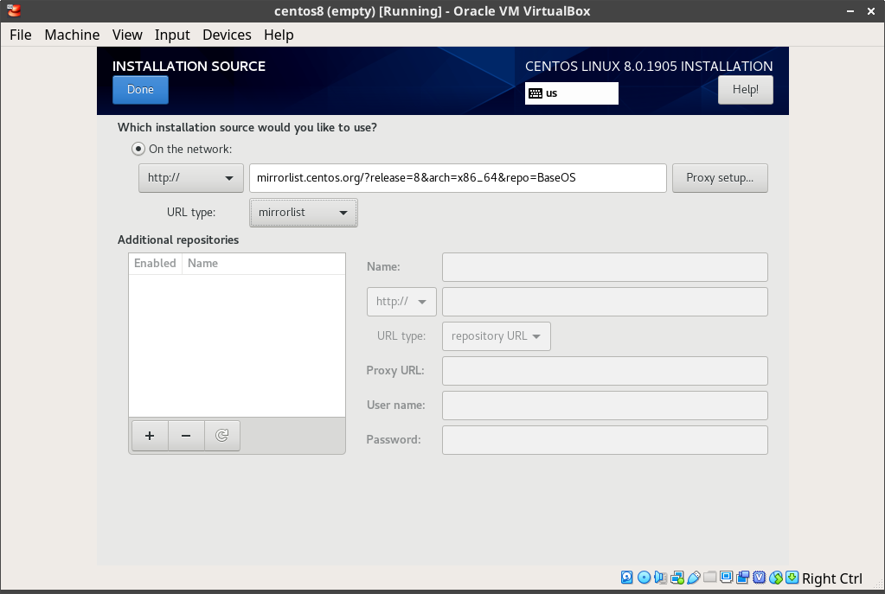
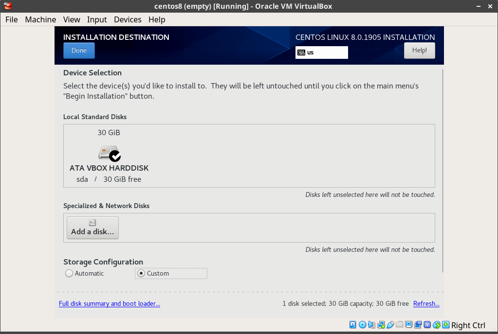
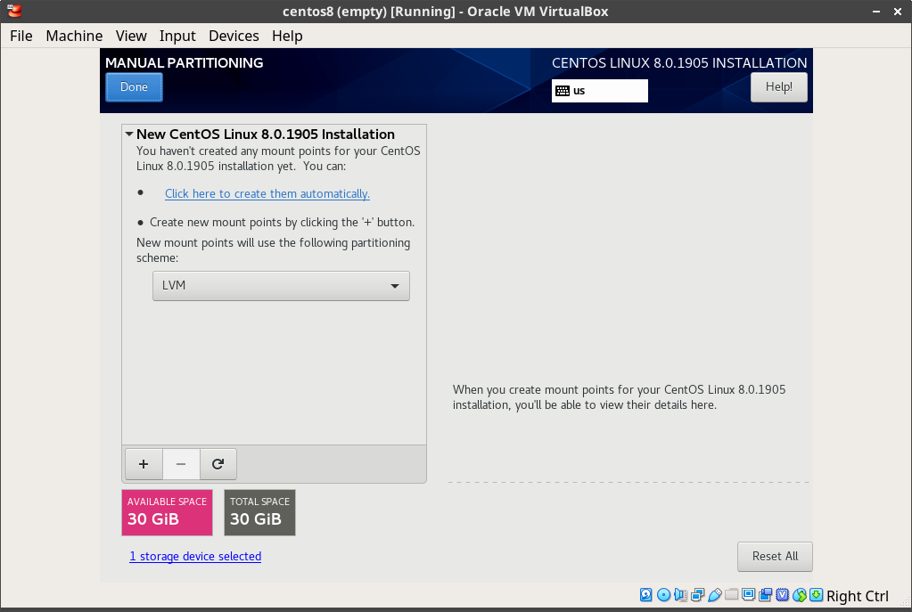
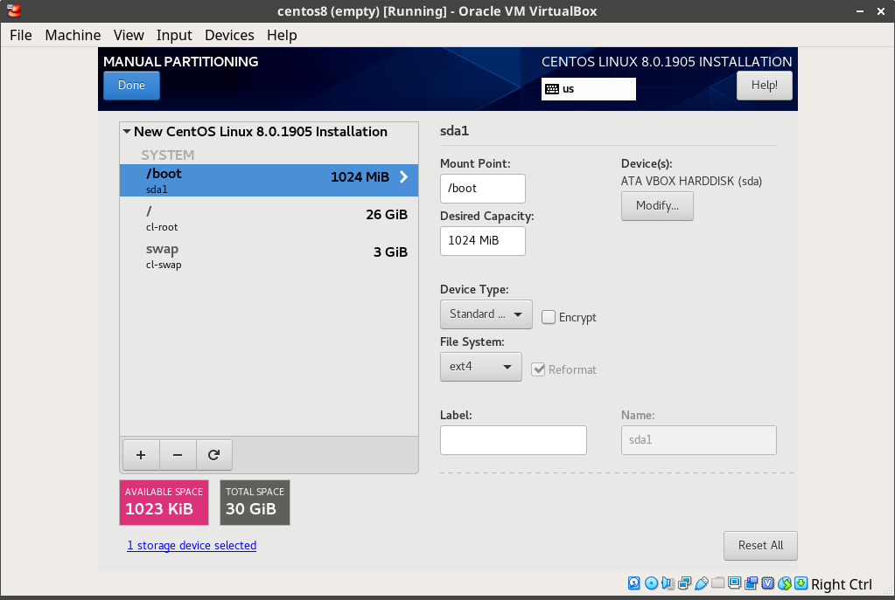

# Viper Set up Guide

The following guide 

## Operating System
d
1. Download CentOS 8

    http://mirror.mobap.edu/centos/8.0.1905/isos/x86_64/CentOS-8-x86_64-1905-boot.iso

2. Set installation source

    There's a known bug ([#16456](https://bugs.centos.org/view.php?id=16456)) during a minimal installation of CentOS 8. It requires that
    you set the Installation Source manually. 

    Currently, the fix is to add the following as a mirrorlist

    http://mirrorlist.centos.org/?release=8&arch=x86_64&repo=BaseOS

    

3. Turn of network

4. Set Installation Destination (configures disk partitions)

    * Select **Custom** for Storage Configuration, Click **Done**
    
    
    
    * Click **Click here to create them automatically** to generate the recommended partitions.
    
    
    
    * Check generated partitions

      This should create a `/boot` (ext4), `/` (xfs, LVM), and `/swap` (swap, LVM) partitions.

    

    * Click **Done**, and then **Accept Changes**

5. Set Software Selection

    * Check Base Environment to **Server**
    * Check Add-Ons:
      * GNOME
      * Network File System Client
      * Headless Management
      * Scientific Support
      * System Tools
      * Graphical Administration Tools

6. Click **Begin Installation**

    * Set `root` password

7. Reboot

8. Log in as `root` and install package group, **Server with GUI**

    ```bash
    dnf groupinstall -y "Server with GUI"
    systemctl set-default graphical.target
    systemctl isolate graphical.target
    ```

### [Optional] Install VirtualBox Guest Additions (VirtualBox Only)

  ```bash
  # Guide: https://www.if-not-true-then-false.com/2010/install-virtualbox-guest-additions-on-fedora-centos-red-hat-rhel/
  ## Fedora 31/30/29/28/27/26/25/24 and CentOS 8 / RHEL 8 ##
  dnf update kernel*

  ## CentOS/RHEL 7/6/5 ##
  yum update kernel*

  reboot

  mkdir /media/VirtualBoxGuestAdditions
  mount -r /dev/cdrom /media/VirtualBoxGuestAdditions

  ## CentOS 8 and Red Hat (RHEL) 8 ##
  dnf install https://dl.fedoraproject.org/pub/epel/epel-release-latest-8.noarch.rpm

  ## CentOS/RHEL 8/7/6/5 ##
  yum install gcc kernel-devel kernel-headers dkms make bzip2 perl

  ## Current running kernel on Fedora 31/30/29/28/27/26/25/24, CentOS 8/7/6 and Red Hat (RHEL) 8/7/6 ##
  KERN_DIR=/usr/src/kernels/`uname -r`

  cd /media/VirtualBoxGuestAdditions

  # Then run following command
  ./VBoxLinuxAdditions.run

  reboot
  ```